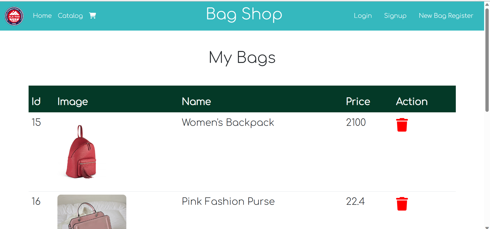
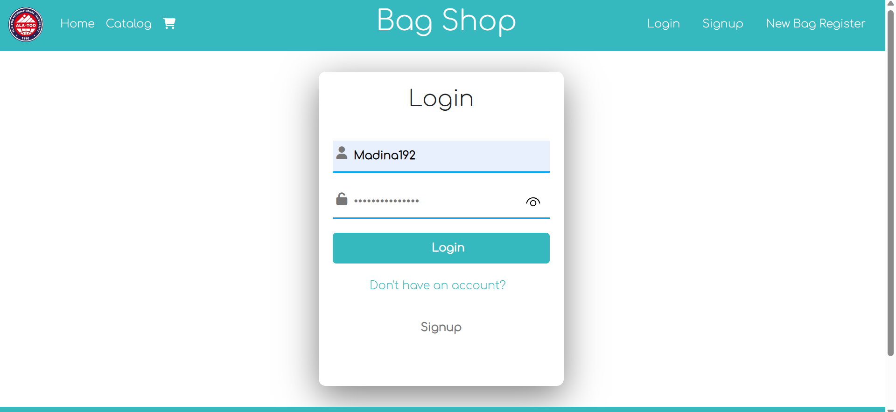

# Online Bag Shop
## We made it together -> Akpaeva Madina and Mamatzhalilova Bermet
## Link to deployed website : https://bagshopspringfinal-production.up.railway.app/
## Link to project presentation: 
## The online bag shop application is built using the Spring Boot framework with Spring Data, Spring Security, Postgres Database.
## Home page
## There's a carousel of pictures of handbags. Clicking on which will take you to the catalog page:

## About section and footer:

## Catalog Page

## Bags are divided into three categories: backpacks, purses and shoppers:


## Cart Page:
## You can see here all bags you have added to your cart:


## Signup page
## You can sign up on this page by entering your login, email and password:

## Login page
## If you have signed up, you can sign in by entering login and password:

## If you entered incorrect data, you'll ger an error:

## When you signed in it redirects you to personal page:

# Database schema:

## pgAdmin screenshots:
## All Bags list:

## Users list:

## My Bags list:

## Swagger API screenshots:


```properties
spring_profiles_active=prod
PROD_DB_HOST=containers-us-west-207.railway.app
PROD_DB_PORT=7826
PROD_DB_NAME=railway
PROD_DB_USERNAME=postgres
PROD_DB_PASSWORD=JHCABTjYSOZUYAPpVGVO
```

